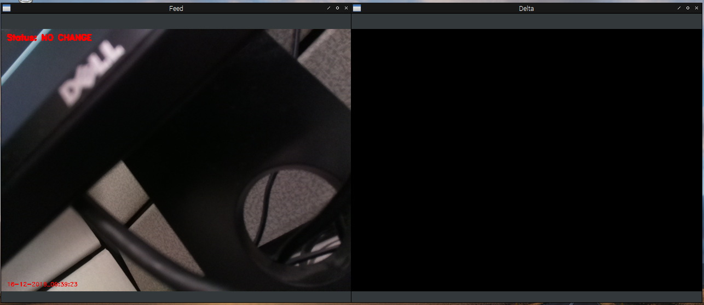
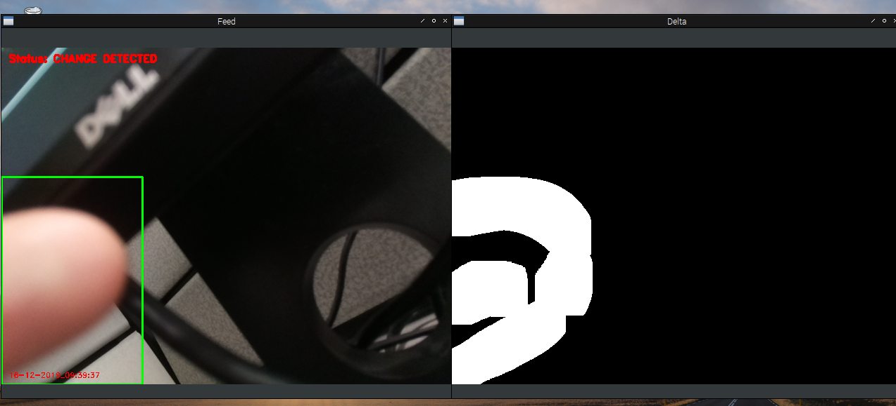

# Raspberry Pi Surveillance Camera
Surveillance camera using motion detection, written in Python for Raspberry Pi. 

## Utilizes:
1. OpenCV for motion detection image analysis
2. Multithreading for video recording in response to motion detection
  * New class for shared resources with a simple lock
  * Event objects for raising flags

## Developed With
1. OpenCV 4.1
2. Raspberry Pi 3 Model B+, Raspbian Stretch
3. Python 3

## Usage
There are two versions of the motion detection script, one with a security feed display and one without (useful when running through ssh).
`mvmt.py` listens for a keypress on `q` to exit, while `mvmt-no-display.py` waits for `q` to be entered through the command line.

### Security Feed Display

